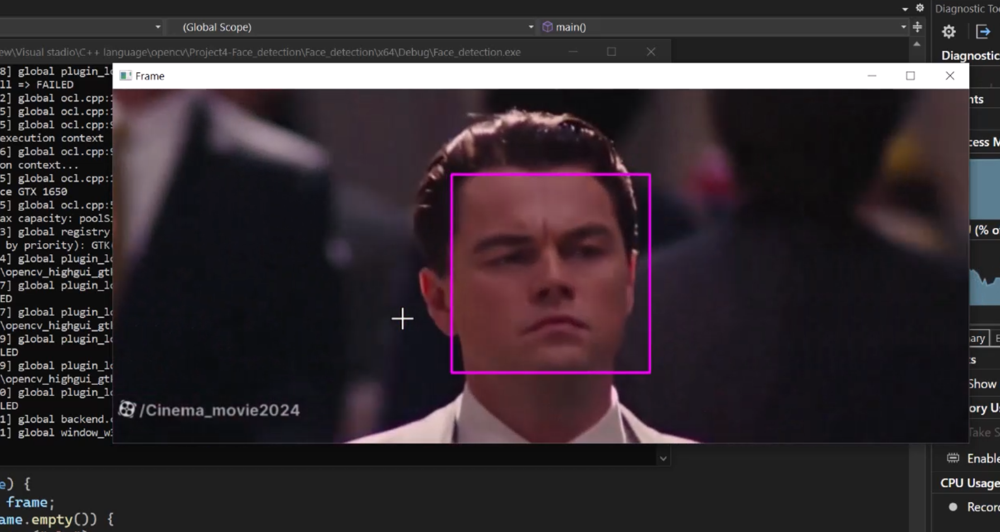
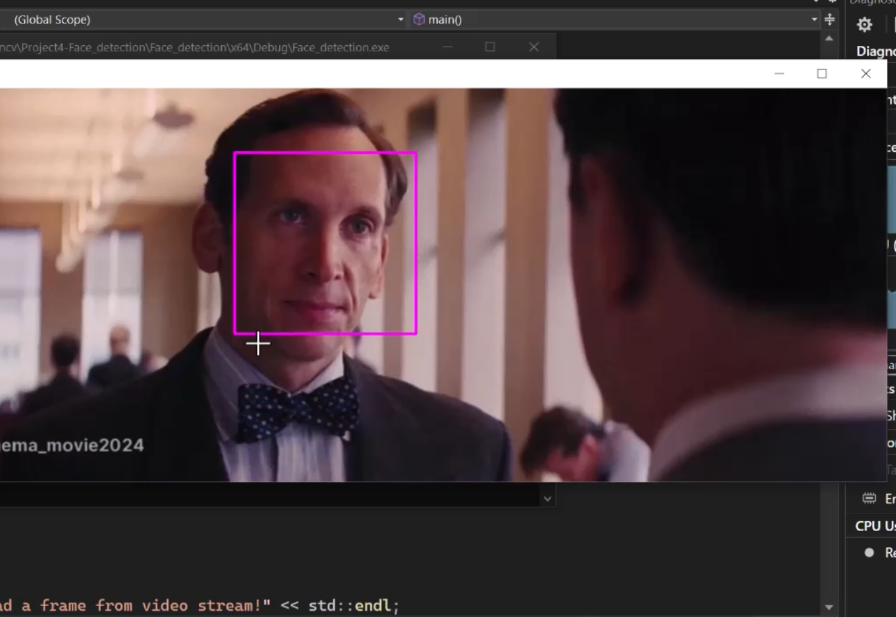
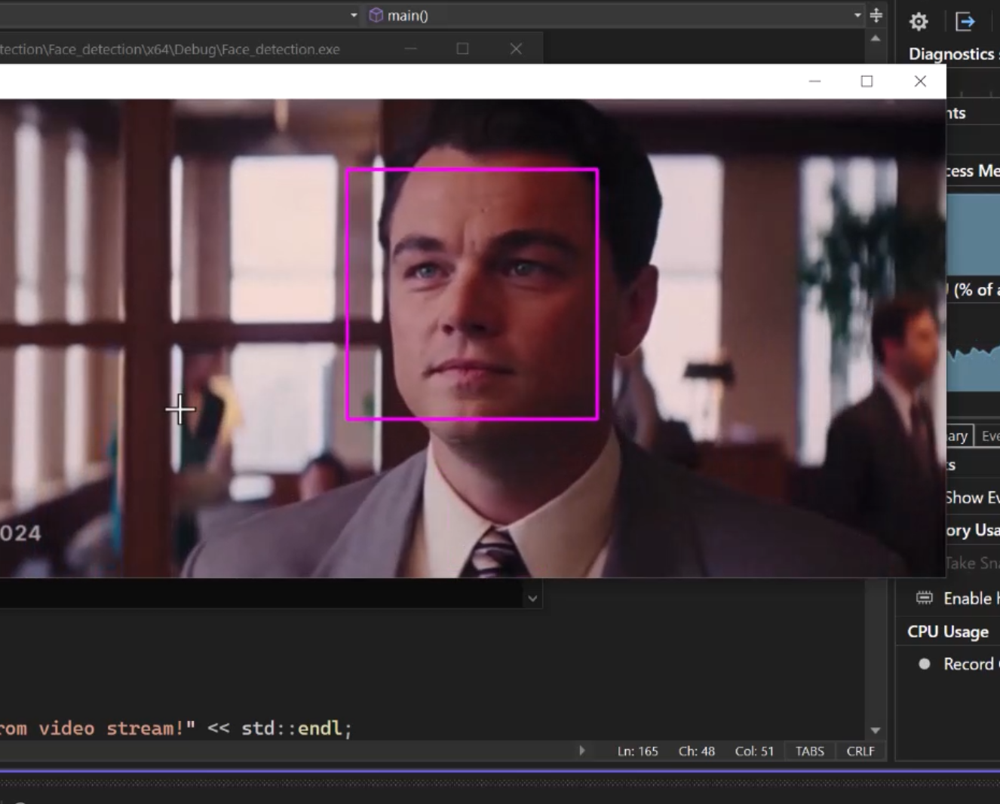
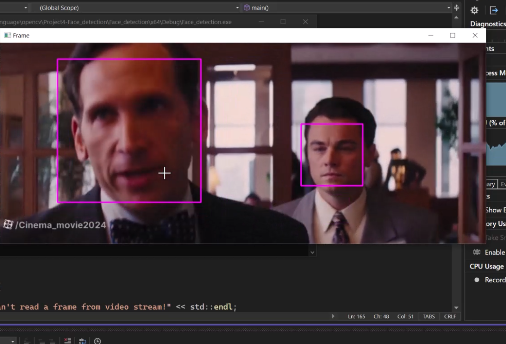

# project :    openCV Face detection C++

* **Developer :  AREF HEYDARI**
* **Date :       03/11/2025**
 

Detecting human face using haarcascade.
  
Note : Watch the provided video to see the project performance.

  
  
  
  

